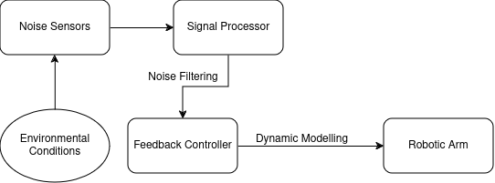
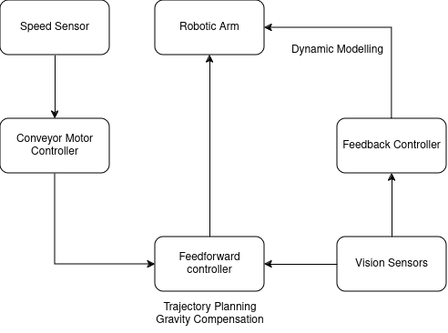
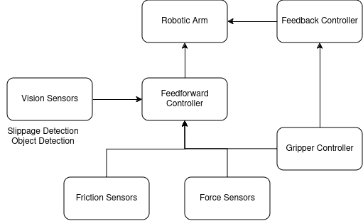

## Question 1 

Design a control algorithm for a robotic arm with the principles of natural movement learnt in this lecture under the following conditions (use the natural intelligence theories learnt in class or refer to any similar ones)

- A shop floor with random mechanical noise
- Perform an actuation on materials moving on a conveyor belt
- Perform a lifting function of an object which might be coated with oil or otherwise, without slippage

What kind of other information might be necessary?

### Answer

When designing a control algorithm for a robotic arm, information about the environment, the arm itself, and the task to be performed is necessary.

Thus, information with respect to the arm such as :

- Specifications of the robotic arm (e.g., degrees of freedom, range of motion, payload capacity, etc.)
- Communication protocols for the different components of the robotic arm
- Type of sensors used for feedback (e.g., encoders, force sensors, etc.) and their accuracy
- Type of actuators used for control (e.g., motors, pneumatic cylinders, etc.) and their response time

1) **Shop floor with random mechanical noise**:

In such a scenario, the control algorithm should be robust to external disturbances and noise. This can be achieved by implementing a feedback control system that continuously monitors the state of the robotic arm and adjusts the control signals to compensate for any disturbances.
12
{width=75%}

- Environmental conditions (e.g., temperature, humidity, lighting, etc.)
- Noise sensors to detect the level of mechanical noise in the shop floor
- Signal processors to filter out the noise and extract relevant information
- Feedback controller to adjust the control signals based on the noise level
- Dynamic moddeling of the robotic arm to predict the effect of noise on the arm's motion

2) **Perform an actuation on materials moving on a conveyor belt**:

In this case, the control algorithm should be able to track the moving materials on the conveyor belt and perform the desired actuation accurately. This can be achieved by implementing a vision-based system that detects the position of the materials and adjusts the control signals accordingly.

{width=75%}

- Speed Sensors to detect the speed of the conveyor belt
- Conveyor belt controller to adjust the speed of the conveyor belt
- Vision sensors to detect the position of the materials on the conveyor belt
- Feedforward control system to predict the motion of the materials and adjust the control signals in advance using trajectory planning and gravity compensation
- Feedback control system to correct any errors in the actuation based on the actual position of the materials
- Dynamic model of the robotic arm to predict the effect of the conveyor belt motion on the arm's motion

3) **Perform a lifting function of an object which might be coated with oil or otherwise, without slippage**:

When lifting an object that is coated with oil or other substances, the control algorithm should be able to adjust the grip force of the end effector to prevent slippage. This can be achieved by implementing a force control system that monitors the force exerted by the end effector and adjusts it to maintain a stable grip on the object.

{width=75%}

- Force sensors to detect the force exerted by the end effector on the object
- Gripper controller to adjust the grip force of the end effector
- Friction sensors to detect the coefficient of friction between the object and the end effector
- Force feedback control system to adjust the grip force based on the force sensors
- Dynamic model of the robotic arm to predict the effect of the object's coating on the grip force

## Question 2

Take a robotic hand with a pincer gripper as the end effector with one degree of freedom at elbow

- Calculate the inverse kinematics equations
- Can inverse dynamics be estimated too? How?

Which ones are easier to optimise? Show with equations.

### Answer

1) **Inverse Kinematics Equations**:

Inverse kinematics is the process of calculating the joint angles required to achieve a desired end effector position.

Let:

- $l_u$ be the length of the upper arm
- $l_f$ be the length of the forearm
- $\theta$ be the angle between the direction of the upper arm and the direction of the forearm
- $x$ be the x-coordinate of the end effector
- $y$ be the y-coordinate of the end effector

Thus,
$$ x = l_u + l_f \cos(\theta) $$
$$ y = l_f \sin(\theta) $$

From the above equations:

$$ \theta = \sin^{-1} \left( \frac{y}{l_f} \right) $$
$$ x = l_u + \sqrt{l_f^2 - y^2} $$

2) **Inverse Dynamics Estimation**:

Inverse dynamics is the process of calculating the forces and torques required at the joints to achieve a desired motion.

Let:

- $m_f$ be the mass of the forearm
- $g$ be the acceleration due to gravity
- $I_f$ be the moment of inertia of the forearm
- $\theta$ be the angle between the direction of the upper arm and the direction of the forearm
- $\alpha$ be the angular acceleration of the forearm

The equations of motion for the robotic arm are given by:

$$ \tau = I_f \alpha + m_f g l_f \cos(\theta) $$
$$ F = m_f g \sin(\theta) $$

Given the desired motion of the end effector, the forces and torques at the joints can be calculated using the above equations.

3) **Optimisation**:

The inverse kinematics equations are easier to optimise as they are simpler and can be solved directly for the desired end effector position in any one coordinate. Given the end effector position, the joint angle can be calculated directly using the inverse kinematics equations.

$$ Err_{IK} = \sqrt{(x_{desired} - x_{actual})^2 + (y_{desired} - y_{actual})^2} $$

The optimisation problem for inverse kinematics can be formulated as:

$$ \min_{\theta} Err_{IK} $$

The inverse dynamics equations are more complex and involve the calculation of forces and torques at the joints to achieve a desired motion. These equations are nonlinear and require the solution of a system of differential equations, which makes them harder to optimise.

$$ Err_{ID} = \sqrt{(F_{desired} - F_{actual})^2 + (\tau_{desired} - \tau_{actual})^2} $$

The optimisation problem for inverse dynamics can be formulated as:

$$ \min_{F, \tau} Err_{ID} $$

Thus, the inverse kinematics equations are easier to optimise compared to the inverse dynamics equations due to their simplicity and direct relationship with the desired end effector position.